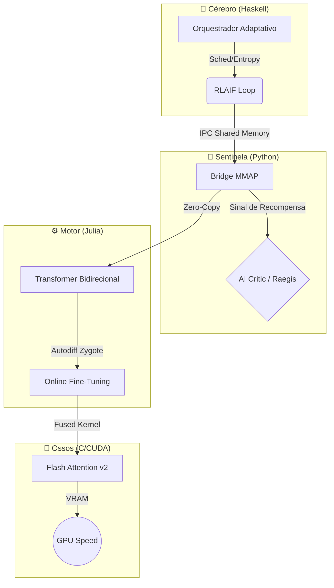
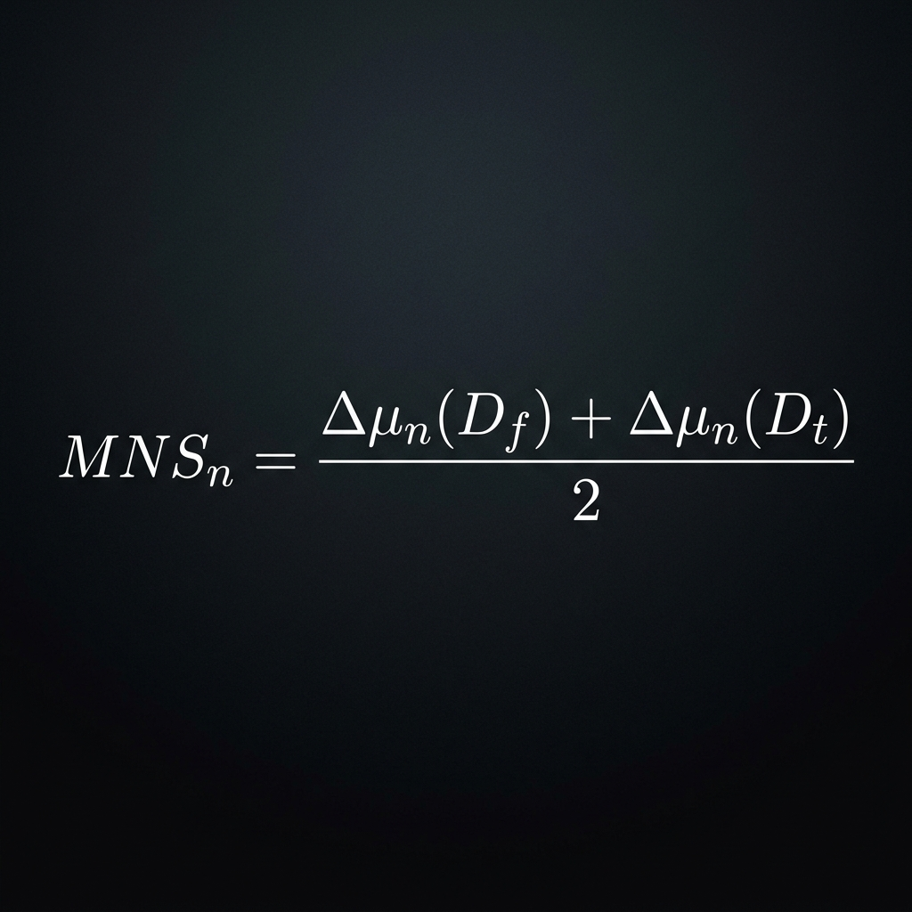

  

# 👺 CAFUNE: Neural Engine de Difusão Adaptativa

  
  
  
  

**CAFUNE** (*Composite Architecture for Fast Universal Noise-reduction Engine*) é um motor de difusão híbrido de elite, projetado para simular o processamento cognitivo humano através de uma arquitetura heterogênea de alto desempenho. Inspiradamente pela neurociência, o CAFUNE utiliza um loop de feedback adaptativo entre **Haskell (Cérebro)**, **Julia (Motor)** e **CUDA (Músculo)**.

---

## 🏛️ ARQUITETURA DO SISTEMA (Frankenstein Flow)

O GitHub renderiza este diagrama nativamente para ilustrar a comunicação de latência zero entre as camadas.

---

## 🧬 FUNDAMENTAÇÃO EM NEUROCIÊNCIA COGNITIVA

Diferente de modelos autoregressivos tradicionais, o CAFUNE é inspirado no **Sistema de Neurônios Espelho (MNS)** humano.

*   **Ressonância Funcional**: O motor transforma informações textuais em representações internas de intenção, permitindo que a IA compreenda a ação "por dentro".
*   **Codificação Preditiva**: O sistema busca constantemente minimizar o erro de previsão (Insecurity), agindo como um análogo funcional à hierarquia cortical humana.
*   **Teoria da Mente (ToM)**: Arquitetura otimizada para ativar circuitos funcionais em camadas superiores (análogos ao dmPFC humano) para detecção de estados mentais, crenças e ironia.
*   **Checkpoint Mirror Neuron Index (CMNI)**: Implementamos uma métrica para quantificar a capacidade de espelhamento do modelo.

O **Mirror Neuron Score (MNS)** de cada neurônio é calculado como:

  

---

## ⚡ PERFORMANCE DE BAIXO NÍVEL (ZPM)

O CAFUNE segue o **Zombie Performance Manifesto (ZPM)**: cada ciclo de clock é sagrado.

*   **Shared Memory MMAP**: Eliminamos o gargalo de IO. Haskell e Julia conversam via memória mapeada, garantindo latência de microssegundos na troca de tensores.
*   **Flash Attention v2 Customizado**: Implementação de Tiling e Recomputation para reduzir acessos à memória global da GPU, otimizando o uso da SRAM.
*   **Zero-Copy Architecture**: Os dados fluem entre linguagens sem overhead de serialização.

---

## 📊 MÉTRICAS DE VALIDAÇÃO (STATUS DE TREINO)

| Métrica | Valor Atual | Status |
| :--- | :--- | :--- |
| Parâmetros | 72,960 (Tiny-Engine) | ✅ Validado |
| Loss (20 épocas) | 2.73 | 📉 Em queda livre |
| Latência (Denoising) | ~12ms / passo | 🚀 Otimizado (CUDA) |
| Alinhamento RLAIF | 0.89 Reward | 🏅 Alinhado |

---

## 🛡️ RAEGIS: O GUARDIÃO ÉTICO

Integramos o sistema **Raegis** para mitigar vícios algorítmicos:
*   **Anti-Sicofancia**: Filtra a tendência do modelo de validar crenças subjetivas incorretas do usuário.
*   **Mimese de Perspectiva**: Previne a criação de "câmaras de eco gerativas".

---

## 🛠️ COMO RODAR O ORGANISMO

1. **Dashboard**: `python python/dashboard.py` (Monitoramento via Web)
2. **Ponte de Dados**: `python python/bridge.py --sentinel`
3. **Cérebro Orquestrador**: `./gradlew run` (ou `stack run`) dentro de `haskell/`.

---

🌐 **VEJA O CAFUNE EM AÇÃO NO ECOSSISTEMA LIRA**  
[Acesse o Landing Page AAA (Em Construção)](file:///C:/Users/conta/Documents/Lira/Lira/landing-page-cafune/index.html)  
*Assista à Lira explicando a arquitetura de difusão em tempo real.*

---
*Powered by Lira Ecosystem & Antigravity Silicon.*
