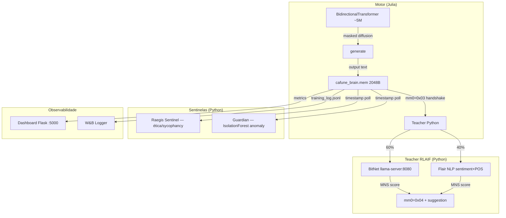

<p align="center">
  
</p>

# CAFUNE: Motor de Difusão Discreta em PT-BR (~5M params)

<p align="center">
  
  
  
  
  
</p>

> _"Não estava eu formando um ser horrível e transgressor?"_ — Mary Shelley

**CAFUNE** é um transformer bidirecional treinado com **difusão discreta mascarada** (estilo LLaDA) para geração de texto em português brasileiro. O pipeline de treinamento é 100% local — sem APIs externas, sem custo por chamada.

---

## Arquitetura



### Mapa de memória (`cafune_brain.mem`, 2048 bytes)

| Offset | Tipo | Escrito por | Propósito |
|--------|------|-------------|-----------|
| 0 | uint8 | Julia / Teacher | Handshake: `0x00`=idle `0x03`=output pronto `0x04`=avaliação pronta |
| 20–28 | float64 | Julia | Timestamp Unix (sentinelas detectam novo output por mudança aqui) |
| 32–40 | float64 | Julia | Loss atual |
| 40–44 | float32 | Teacher | MNS score — BitNet+Flair combinado |
| 44–48 | float32 | Teacher | MNS local — apenas Flair |
| 48–52 | float32 | Raegis | Raegis penalty (×2 se ethics flag = 1) |
| 52–56 | float32 | Guardian | Guardian penalty ∈ [0, 0.5] — anomalia comportamental |
| 60 | uint8 | Raegis | Ethics flag: `0x01` = sycophancy detectada |
| 200–600 | UTF-8 | Julia | Output do modelo |
| 600–1000 | UTF-8 | Julia | Prompt de contexto |
| 1001–1400 | UTF-8 | Teacher | Sugestão de melhoria |
| 1401–1800 | UTF-8 | Teacher | Razão da avaliação |

---

## Especificações

| Item | Valor |
|:-----|:------|
| Parâmetros | ~5M (d_model=256, 8 heads, 6 layers) |
| Vocabulário | 500 tokens BPE — 413 valid_ids (len≤4), 38 com acentos PT-BR |
| Sequência | 128 tokens |
| Difusão | LLaDA-style masked discrete diffusion, 20 denoising steps, temp=0.5 |
| Treino | LR=5e-6 constante, Adam, Zygote autodiff |
| Dataset | ~6000 pares PT-BR em `bercario_data.jsonl` |
| Teacher | BitNet 60% (semântica) + Flair 40% (sentimento + POS + cobertura) |
| Monitoramento | W&B projeto `cafune` + Dashboard local :5000 |

---

## MNS — Mirror Neuron Score

O **MNS** avalia a qualidade da resposta gerada em três dimensões:

| Dimensão | Peso | Como é medido |
|:---------|:-----|:--------------|
| D_sentiment | 40% | Flair TextClassifier — polaridade da resposta vs prompt |
| D_grammar | 35% | Flair POS tagger — diversidade lexical e cobertura gramatical |
| D_coverage | 25% | Sobreposição de keywords entre prompt e resposta |

O score BitNet (60% do reward final) avalia coerência semântica via `llama-server` local com o modelo BitNet-b1.58-2B-4T.

---

## Como executar

### Pré-requisitos

```bash
# 1. Variáveis de ambiente
cp .env.example .env
# Edite .env com WANDB_API_KEY (opcional — só para monitoramento W&B)

# 2. Dependências Python
pip install -r python/requirements.txt

# 3. Dependências Julia
julia --project=julia -e 'using Pkg; Pkg.instantiate()'

# 4. BitNet (opcional — teacher semântico)
# Baixe e compile: https://github.com/microsoft/BitNet
# Modelo: BitNet-b1.58-2B-4T (GGUF)
# Inicie: llama-server.exe --port 8080 --model <caminho>
```

### Iniciar tudo

```bash
start_all_services.bat
```

Inicia na ordem: Julia → Teacher → Data Generator → Dashboard → Raegis → Guardian → W&B Logger.

### Serviços individuais

```bash
# Motor de treino Julia
start_julia.bat

# Teacher RLAIF (BitNet + Flair)
python python/gemini_teacher.py

# Gerador de dataset PT-BR
python python/data_generator.py

# Dashboard (http://localhost:5000)
python python/dashboard.py

# Sentinela ética
python python/raegis_sentinel.py

# Guardian anomaly
python python/guardian_reward.py

# W&B logger
python python/wandb_logger.py
```

### Regenerar vocabulário

```bash
# Preview — não sobrescreve vocab.json
python python/rebuild_vocab.py

# Aplicar (invalida checkpoints — requer retrain do zero)
python python/rebuild_vocab.py --apply
```

### Testes

```bash
python -m pytest python/tests/ -v
```

---

*Powered by Lira Ecosystem & Antigravity Silicon.*
