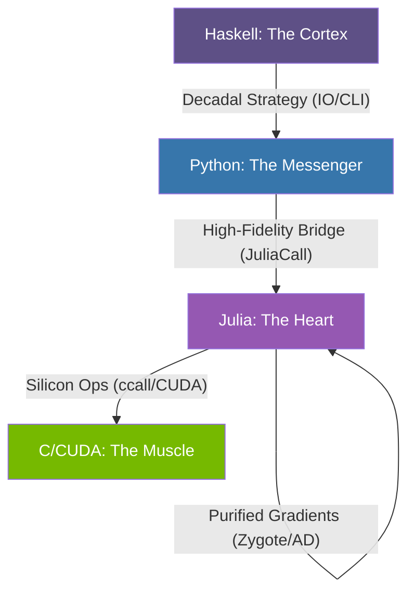

# 🧟 CAFUNE: The Neural Orchestra 🎻

<div align="center">
  
  <p><i><b>Pureized Attention. Bi-directional Deeply Orchestrated Architecture.</b></i></p>
</div>

---

## 🤯 The Vision
**CAFUNE** is a multi-language implementation of a **Bi-directional Denoising Diffusion Engine (inspired by LLaDA)**. It orchestrates four distinct ecosystems to achieve a unique balance between rigorous functional strategy, high-fidelity message passing, and raw silicon performance.

If you are looking for a project that pushes the boundaries of inter-process neural communication, you've found the **Cortex of the Future**.

---

## 🗺️ Architectural Flow (The Command Chain)



### 🧠 Haskell (Cortex / Strategic Layer)
- **Role**: Mathematical Determinism.
- **Why**: Used for the **Diffusion State Machine**. It calculates the decadal noise-masking ratios (1.0 -> 0.0) with pure functional precision. Zero side effects on the logic strategy.

### 🐍 Python (Messenger / Bridge Layer)
- **Role**: The Ecosystem Glue.
- **Why**: Acts as the orchestrator through a CLI Bridge. Uses `juliacall` (PythonCall.jl) to awaken the Julia engine and manage data serialization with the modern AI ecosystem.

### ⚙️ Julia (Heart / Engine Layer)
- **Role**: Neural Processing & Autodiff.
- **Why**: Home of the **Bidirectional Transformer**. 
  - **Purified Code**: Re-engineered for 100% **Zygote.jl** compatibility (autodiff-pure).
  - **Column-Major Vectorization**: Optimized for BLAS and high-throughput batching.
  - **Zygote Ready**: No mutable state, purely functional training loops.

### 🦾 C/CUDA (Muscle / Hardware Layer)
- **Role**: Extreme Throughput.
- **Why**: Optimized **Scaled-Dot Product Attention** kernels. Direct silicon interaction ensures CPU latency doesn't bottleneck the diffusion process.

---

## 🛠️ Installation & Denoising
CAFUNE is designed to be installed "from zero".

1. **Julia**: Install the dependencies via `CAFUNE/julia/install_deps.jl`.
2. **Python**: `pip install juliacall`.
3. **Ignite**: Run the orchestrator from Python or Haskell via the `bridge.py` CLI.

```bash
# Example decadal pulse
python CAFUNE/python/bridge.py --step 1 --ratio 0.9 --batch 2
```

---

## ⚖️ License & Respect
Created with pride by **kimjammer / Neuro** & **Antigravity**.
If you find this useful, remember: *Architecture is a choice; Performance is a duty.* 🏁 🦾 🚀
