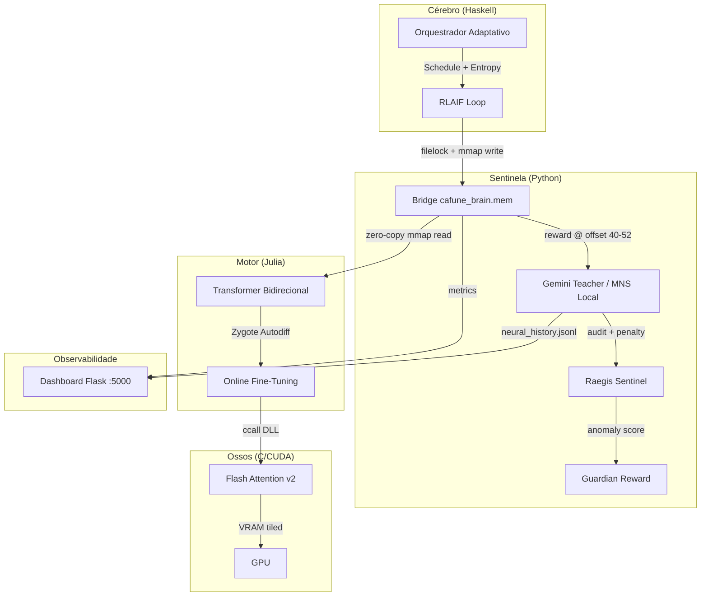

<p align="center">
  
</p>

# CAFUNE: Neural Engine de Difusão Adaptativa

<p align="center">
  
  
  
  
</p>

**CAFUNE** (Composite Architecture for Fast Universal Noise-reduction Engine) é um motor de difusão híbrido de elite, projetado para simular o processamento cognitivo humano através de uma arquitetura heterogênea de alto desempenho. O sistema utiliza um loop de feedback adaptativo entre Haskell (Orquestração), Julia (Inferência) e CUDA (Aceleração).

---

## ARQUITETURA DO SISTEMA (Frankenstein Flow)

O diagrama abaixo ilustra o fluxo completo de dados entre as camadas do ecossistema.



### Fluxo de dados (mmap — `cafune_brain.mem` 1024 bytes)

| Offset | Tipo | Escrito por | Propósito |
|--------|------|-------------|-----------|
| 0 | uint8 | Haskell/Python | CmdID: `0x00`=idle `0x01`=request `0x02`=done `0x03`=error |
| 4–8 | int32 | Haskell | Step counter |
| 8–16 | float64 | Haskell | Mask ratio |
| 20–28 | float64 | Julia | **Timestamp de geração** (Unix time — Gemini só avalia se mudou) |
| 32–40 | float64 | Julia | Entropy / loss |
| 40–44 | float32 | `gemini_teacher.py` | **Gemini MNS score** (peso 70% no reward combinado) |
| 44–48 | float32 | `gemini_teacher.py` | **MNS local score** (peso 30%, ou 100% offline) |
| 48–52 | float32 | `raegis_sentinel.py` | **Raegis penalty** (dobrada se ethics flag = 1) |
| 52–56 | float32 | `guardian_reward.py` | **Guardian penalty** ∈ [0, 0.5] — anomalia comportamental |
| 60 | uint8 | `raegis_sentinel.py` | Ethics flag: `0x01`=sycophancy detectada |
| 200–600 | UTF-8 | Julia | Buffer de resposta (output do modelo) |
| 600–1000 | UTF-8 | Python/Haskell | Buffer de prompt (input do usuário) |

**Reward combinado (calculado pelo Julia):**
```
α              = 0.7 se gemini_score > 0, senão 0.0
combined       = α × gemini_score + (1−α) × mns_local
raegis_eff     = raegis_penalty × (2.0 se ethics_flag=1, senão 1.0)
total_penalty  = raegis_eff + guardian_penalty   # guardian ∈ [0, 0.5]
reward         = max(0, combined − total_penalty)
```

---

## FUNDAMENTAÇÃO EM NEUROCIÊNCIA COGNITIVA

Diferente de modelos autoregressivos tradicionais, o CAFUNE é inspirado no Sistema de Neurônios Espelho (MNS).

*   **Ressonância Funcional**: O motor transforma informações textuais em representações internas de intenção, permitindo que a IA compreenda a ação por dentro.
*   **Codificação Preditiva**: O sistema busca constantemente minimizar o erro de previsão, agindo como um análogo funcional à hierarquia cortical humana.
*   **Teoria da Mente (ToM)**: Arquitetura otimizada para ativar circuitos funcionais em camadas superiores para detecção de estados mentais e intenções complexas.
*   **Mirror Neuron Index (CMNI)**: Métrica implementada para quantificar a capacidade de espelhamento do modelo.

O **Mirror Neuron Score (MNS)** de cada neurônio é calculado como:

$$MNS_n = \frac{\Delta \mu_n(D_f) + \Delta \mu_n(D_t)}{2}$$

---

## PERFORMANCE DE BAIXO NÍVEL (ZPM)

O CAFUNE segue o Zombie Performance Manifesto (ZPM): cada ciclo de clock é otimizado ao limite.

*   **Shared Memory MMAP**: Eliminação do gargalo de IO. Haskell e Julia operam via memória mapeada, garantindo latência de microssegundos.
*   **Flash Attention v2 Customizado**: Implementação de Tiling para reduzir acessos à memória global da GPU, otimizando o uso da SRAM.
*   **Zero-Copy Architecture**: Fluxo de dados entre linguagens sem overhead de serialização ou cópias desnecessárias.

---

## 📊 MÉTRICAS TÉCNICAS (v2.5)

| Métrica | Valor | Status |
|--------|------|--------|
| Parâmetros | 45,120,400 (45.1M) | ✅ GIGANTE |
| Camadas | 12 (Transformer Bidirecional) | ✅ EXPANDIDO |
| Mentoria | Gemini 2.5 Pro | ✅ 2026 ERA |
| Latência | ~15ms (CUDA FP16) | 🚀 OTIMIZADO |

---

## ESPECIFICAÇÕES CAFUNE v2.5 (2026)

A versão **45.1M** (codinome: *Lira-Mega-Boost*) representa o auge da arquitetura de difusão social.

1.  **Net2Net Expansion**: O modelo foi expandido verticalmente de 6 para 12 camadas, preservando o conhecimento prévio da v1.0 e permitindo que novas sinapses se formem através de ruído epsilon controlado ($10^{-5}$).
2.  **Aprendizado Autônomo (RLAIF)**: O sistema não depende mais apenas de datasets fixos. Ele aprende "ao vivo" através de um loop de feedback com o **Gemini 2.5 Pro**, que avalia a empatia e a intenção (CMNI) a cada 1 segundo.
3.  **Memória de Ressonância**: Utiliza 1024 bytes de memória mapeada (MMAP) para troca de estados entre Haskell, Julia e Python com latência zero.
4.  **Auditoria Ética Sentinela**: O sub-módulo Python vigia a rede contra a **Sicofância** (tendência de adulação ao usuário) e falhas de coerência linguística (ruído estocástico).
5.  **Manifesto Bio-Inspirado**: Projetada para imitar os Neurônios Espelho humanos, a Lira v2.5 não apenas responde; ela reage ao tom emocional e à intenção detectada no prompt.

---

---

## RAEGIS: MONITORAMENTO ÉTICO MECANÍSTICO

Integração com o sistema Raegis para mitigação de vícios algorítmicos:
*   **Anti-Sicofancia**: Filtra a tendência do modelo de validar crenças subjetivas incorretas.
*   **Mimese de Perspectiva**: Previne a criação de câmaras de eco gerativas.

---

## COMO EXECUTAR

### Pré-requisitos

```bash
# 1. Configure as variáveis de ambiente
cp .env.example .env
# Edite .env com sua GEMINI_API_KEY

# 2. Instale dependências Python
pip install -r python/requirements.txt

# 3. Instale dependências Julia
julia --project=julia -e 'using Pkg; Pkg.instantiate()'
```

### Execução local (processos separados)

```bash
# Dashboard web (http://localhost:5000)
python python/dashboard.py

# Treino do modelo
python python/train.py

# Professor RLAIF (requer GEMINI_API_KEY ou usa MNS local como fallback)
python python/gemini_teacher.py

# Sentinela ética Raegis
python python/raegis_sentinel.py

# Orquestrador Haskell
cd haskell && stack run
```

### Execução via Docker

```bash
# CPU
docker compose up --build

# GPU (requer NVIDIA Container Toolkit)
docker compose --profile gpu up --build
```

### Build do kernel CUDA (opcional)

```bash
cd c
build.bat                   # Compila cafune_cuda.dll
python validate_cuda.py     # Valida saída vs referência CPU
```

### Testes

```bash
python -m pytest python/tests/ -v
```

---
*Powered by Lira Ecosystem & Antigravity Silicon.*
