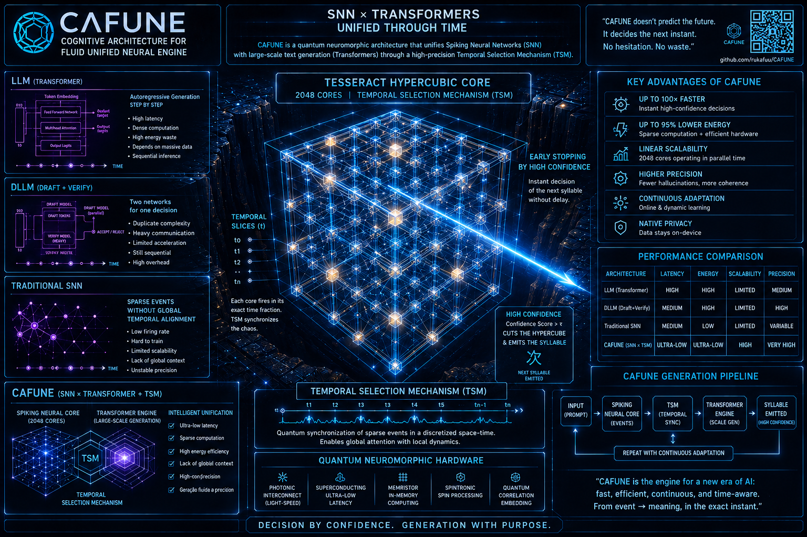
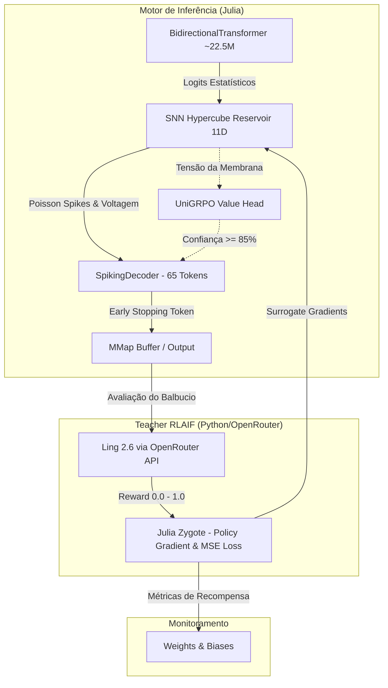

<p align="center">
  
</p>

# CAFUNE: Motor SNN 11D + Transformer Bidirecional (~22.5M params)

<p align="center">
  
  
  
  
  
</p>

<br>

<p align="center">
  
</p>

> _"Não estava eu formando um ser horrível e transgressor?"_ — Mary Shelley

**CAFUNE** (Cognição Artificial Fundamentada em Neuromorfologia) é um motor de IA híbrido escrito em Julia. Ele combina um Transformer clássico para a base de conhecimento com um **Reservatório Spiking Neural Network (SNN) de 11 Dimensões**, trazendo dinâmica temporal e biológica para o processo de geração. O modelo passa por alinhamento ético contínuo via **RLAIF (Reinforcement Learning from AI Feedback)**.

---

## Arquitetura Híbrida



### O Hipercubo 11D (SNN Reservoir)
Em vez de um *Softmax* determinístico, os logits do Transformer são projetados num reservatório caótico de 2048 neurônios organizados numa topologia de **Hipercubo 11D** (cada neurônio tem exatamente 11 conexões de distância de Hamming 1). A saída é lida medindo a "tensão residual" da membrana (Leaky Integrate-and-Fire) usando temperatura estocástica.

Nesta versão, a dinâmica SNN atingiu a Singularidade com três inovações:
1. **Surrogate Gradients**: A função Heaviside (disparo duro) é contornada no *backward pass* do Zygote através da derivada de uma Sigmoide, permitindo o escoamento de Policy Gradient pelas voltagens.
2. **PLIF + TSM (Temporal-wise Spiking Mechanism)**: O decaimento temporal e o nível de excitação da membrana são vetores treináveis (`tsm_gamma` e `decay_array`) ajustados a cada passo do tempo, ensinando a rede a encontrar o "ritmo e sotaque" da prosódia brasileira.
3. **UniGRPO Value Head (Early Stopping Cognitivo)**: Uma rede MLP acoplada aos 2048 neurônios monitora a confiança interna a cada *timestep*. Se a certeza atingir 85% antes dos 30 passos, a decodificação sofre *Early Stopping*, gerando inferências ultrarrápidas em tokens óbvios e dedicando processamento completo aos cenários complexos (Difusão Discreta).

---

## Especificações do Motor

| Item | Valor |
|:-----|:------|
| Parâmetros (Base) | ~22.5M (d_model=512, 12 heads, 6 layers) |
| SNN Reservoir | 2048 PLIF Neurons (11D Topology) com Surrogate Gradients |
| Value Head | UniGRPO Early Stopping Predictor (Cognitive Pulsing) |
| Tempo Cognitivo | 30 Timesteps Dinâmicos (TSM Adaptativo) |
| Treino Base | Cosine LR, Adam, Zygote autodiff, GPU/CPU |
| Treino SNN (RLAIF)| Policy Gradient + MSE Loss sobre o Readout Layer e Value Head (Teacher: Ling 2.6) |
| Monitoramento | W&B projeto `Lira-CAFUNE` nativo no Python |

---

## RLAIF — Reinforcement Learning from AI Feedback

Diferente de um modelo determinístico, a natureza caótica da SNN produz "balbucios" e variações na geração (Sampling Estocástico).
O loop RLAIF funciona assim:
1. O modelo tenta responder a um prompt e gera `N` variações.
2. O **Raegis** (Juiz alimentado por Ling 2.6 no OpenRouter) lê as variações e julga qual soa mais natural, coerente e com alta empatia (Mirror Neuron Score).
3. O Zygote penaliza a voltagem que gerou as respostas fracas e recompensa o caminho sináptico que gerou as respostas boas, moldando a "mandíbula" da Lira com o tempo.

---

## Como executar

### Pré-requisitos

```bash
# 1. Variáveis de ambiente
cp .env.example .env
# Edite .env com WANDB_API_KEY (opcional — só para monitoramento W&B)

# 2. Dependências Python
pip install -r python/requirements.txt

# 3. Dependências Julia
julia --project=julia -e 'using Pkg; Pkg.instantiate()'

# 4. BitNet (opcional — teacher semântico)
# Baixe e compile: https://github.com/microsoft/BitNet
# Modelo: BitNet-b1.58-2B-4T (GGUF)
# Inicie: llama-server.exe --port 8080 --model <caminho>
```

### Iniciar tudo

```bash
start_all_services.bat
```

Inicia na ordem: Julia → Teacher → Data Generator → Dashboard → Raegis → Guardian → W&B Logger.

### Serviços individuais

```bash
# Motor de treino Julia
start_julia.bat

# Teacher RLAIF (BitNet + Flair)
python python/gemini_teacher.py

# Gerador de dataset PT-BR
python python/data_generator.py

# Dashboard (http://localhost:5000)
python python/dashboard.py

# Sentinela ética
python python/raegis_sentinel.py

# Guardian anomaly
python python/guardian_reward.py

# W&B logger
python python/wandb_logger.py
```

### Regenerar vocabulário

```bash
# Preview — não sobrescreve vocab.json
python python/rebuild_vocab.py

# Aplicar (invalida checkpoints — requer retrain do zero)
python python/rebuild_vocab.py --apply
```

### Testes

```bash
python -m pytest python/tests/ -v
```

---

*Powered by Lira Ecosystem & Antigravity Silicon.*
